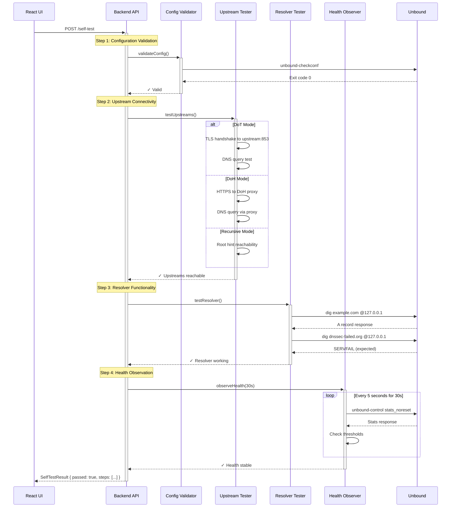
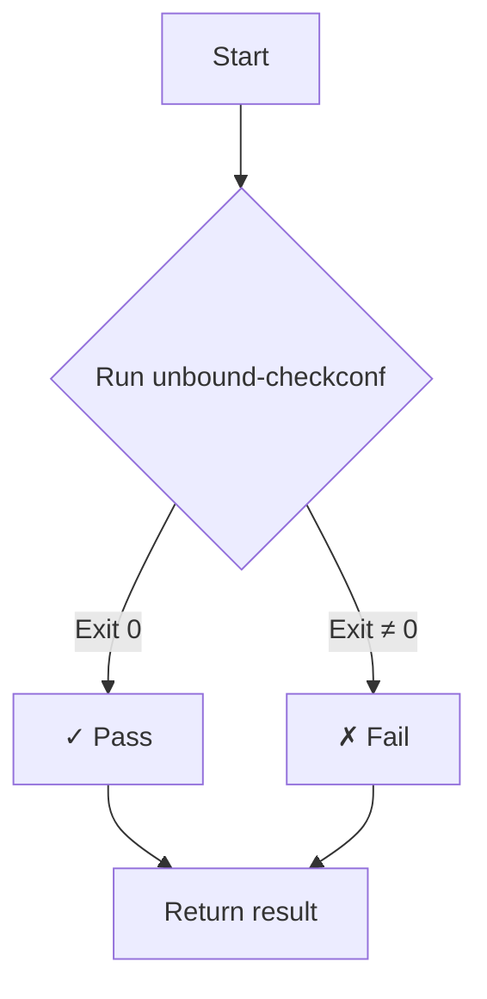
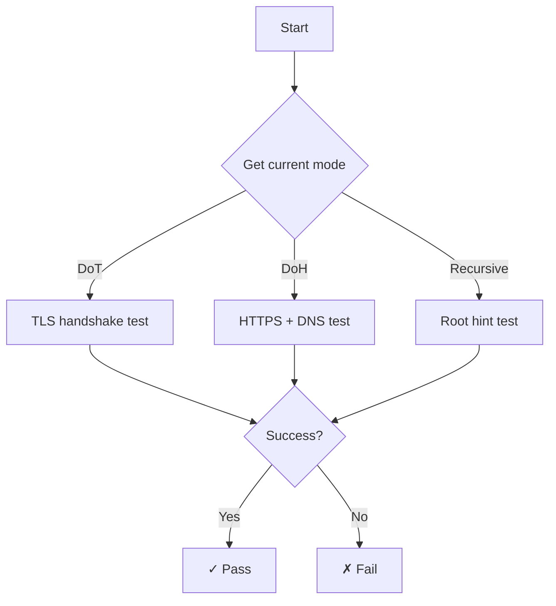
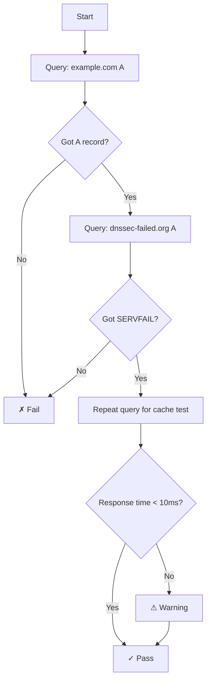
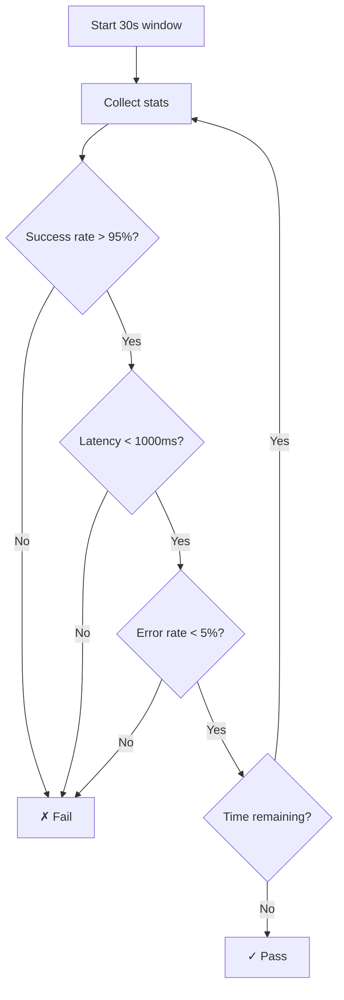
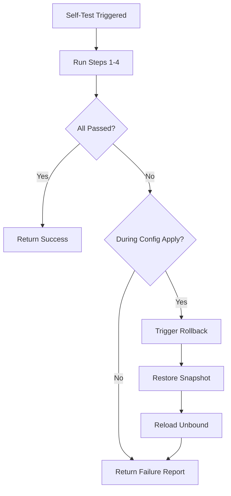

# Self-Test Sequence Diagram

## Overview

This diagram illustrates the self-test workflow triggered after configuration changes or on-demand.

---

## Sequence Diagram



---

## Step Details

### Step 1: Configuration Validation



**Checks:**

- Unbound configuration syntax
- Include file validity
- Forward zone configuration

---

### Step 2: Upstream Connectivity



**Tests by Mode:**

| Mode      | Test                                             |
| --------- | ------------------------------------------------ |
| DoT       | TLS connection to `upstream:853`, send DNS query |
| DoH       | HTTPS request to proxy, DNS response validation  |
| Recursive | UDP query to root hints                          |

---

### Step 3: Resolver Functionality



---

### Step 4: Health Observation



---

## Response Format

```json
{
  "success": true,
  "data": {
    "passed": true,
    "steps": [
      {
        "name": "config_validation",
        "passed": true,
        "duration": 150
      },
      {
        "name": "upstream_connectivity",
        "passed": true,
        "duration": 820
      },
      {
        "name": "resolver_functionality",
        "passed": true,
        "duration": 340
      },
      {
        "name": "health_observation",
        "passed": true,
        "duration": 30000
      }
    ],
    "totalDuration": 31310
  }
}
```

---

## Failure Handling



---

## Related Documents

- [07-testing.md](../memorybank/07-testing.md) – Testing strategy
- [01-requirements.md](../memorybank/01-requirements.md) – Self-test requirements
- [09-runbook.md](../memorybank/09-runbook.md) – Troubleshooting
