# System Context Diagram

## Overview

This diagram shows the high-level system context and data flow between components.

---

## Component Diagram

```mermaid
graph TB
    subgraph "Client Layer"
        Browser["🌐 Browser<br/>(LAN Only)"]
    end

    subgraph "Application Layer"
        UI["⚛️ React Frontend<br/>Glassmorphism UI"]
        Backend["🟢 Node.js Backend<br/>Fastify/Express"]
    end

    subgraph "Service Layer"
        Unbound["🔒 Unbound<br/>DNS Resolver"]
        DoHProxy["☁️ DoH Proxy<br/>cloudflared"]
        Pihole["🕳️ Pi-hole<br/>DNS Blocker"]
    end

    subgraph "External"
        Upstream["🌍 Upstream DNS<br/>DoT/DoH Servers"]
        Root["🌐 Root Servers<br/>(Recursive Mode)"]
    end

    Browser -->|HTTPS| UI
    UI -->|API Calls| Backend

    Backend -->|unbound-control| Unbound
    Backend -->|systemctl| DoHProxy
    Backend -->|API Read| Pihole

    Unbound -->|Forward| DoHProxy
    DoHProxy -->|HTTPS| Upstream
    Unbound -->|DoT| Upstream
    Unbound -->|UDP| Root

    Pihole -.->|Upstream| Unbound

    classDef client fill:#e1f5fe,stroke:#01579b
    classDef app fill:#f3e5f5,stroke:#7b1fa2
    classDef service fill:#e8f5e9,stroke:#2e7d32
    classDef external fill:#fff3e0,stroke:#ef6c00

    class Browser client
    class UI,Backend app
    class Unbound,DoHProxy,Pihole service
    class Upstream,Root external
```

---

## Data Flow

### Control Flow (Configuration)

### Query Flow (DNS Resolution)

---

## Port Assignments

| Service   | Port | Protocol  | Purpose            |
| --------- | ---- | --------- | ------------------ |
| Pusula UI | 3000 | HTTPS     | Web interface      |
| Pi-hole   | 53   | DNS       | Client-facing DNS  |
| Unbound   | 5335 | DNS       | Recursive resolver |
| DoH Proxy | 5053 | DNS/HTTPS | DoH forwarding     |

---

## Trust Boundaries

---

## Related Documents

- [02-architecture.md](../memorybank/02-architecture.md) – Detailed architecture
- [00-context.md](../memorybank/00-context.md) – Project context
