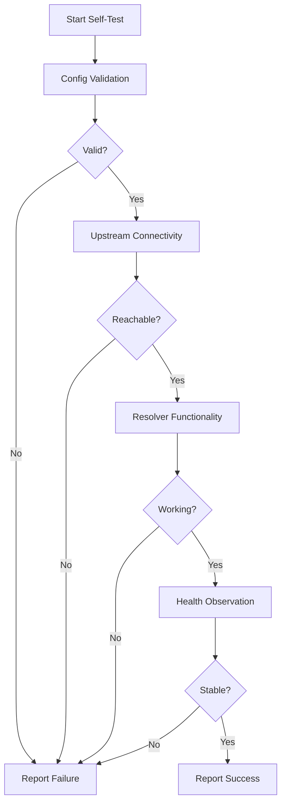

# Testing

## Testing Strategy

Pusula employs multiple testing layers to ensure reliability.

---

## Test Categories

| Category          | Purpose                   | Execution                  |
| ----------------- | ------------------------- | -------------------------- |
| Unit Tests        | Test individual functions | `npm test`                 |
| Integration Tests | Test API endpoints        | `npm run test:integration` |
| Self-Test Engine  | Runtime system validation | Via UI or API              |

---

## Unit Tests

### Backend

| Area     | Tests                                       |
| -------- | ------------------------------------------- |
| Auth     | Password hashing, JWT generation/validation |
| Config   | YAML parsing, validation, diff generation   |
| Commands | Allowlist enforcement, output parsing       |
| Alerts   | Threshold evaluation, state management      |

### Frontend

| Area       | Tests                             |
| ---------- | --------------------------------- |
| Components | Render tests, snapshot tests      |
| Hooks      | State management, API integration |
| Utils      | Formatting, validation helpers    |

### Running Tests

```bash
# Backend unit tests
cd /opt/pusula/backend
npm test

# Frontend unit tests
cd /opt/pusula/frontend
npm test

# With coverage
npm run test:coverage
```

---

## Integration Tests

### API Tests

Test complete request/response cycles:

```bash
npm run test:integration
```

| Endpoint              | Test Cases                                                  |
| --------------------- | ----------------------------------------------------------- |
| `POST /login`         | Valid credentials, invalid password, rate limiting, lockout |
| `GET /unbound/status` | Auth required, success response                             |
| `PUT /upstream`       | Validation, snapshot creation, rollback                     |
| `POST /self-test`     | Full sequence execution                                     |

### Setup

Integration tests require:

- Test instance of backend
- Mock Unbound (or test Unbound installation)
- Test configuration file

---

## Self-Test Engine

The self-test engine performs runtime validation of the DNS system.

### Test Sequence



### Step 1: Configuration Validation

| Check         | Method                        |
| ------------- | ----------------------------- |
| Syntax        | `unbound-checkconf`           |
| Managed files | YAML/config syntax validation |

### Step 2: Upstream Connectivity

| Mode      | Check                                 |
| --------- | ------------------------------------- |
| DoT       | TLS handshake to upstream:853         |
| DoH       | HTTPS connection + DNS query to proxy |
| Recursive | Root hint reachability                |

### Step 3: Resolver Functionality

| Check             | Query                                   |
| ----------------- | --------------------------------------- |
| Basic resolution  | `example.com A`                         |
| DNSSEC validation | `dnssec-failed.org A` (expect SERVFAIL) |
| Cache operation   | Repeat query, verify instant response   |

### Step 4: Health Observation

| Metric             | Threshold | Duration   |
| ------------------ | --------- | ---------- |
| Query success rate | > 95%     | 30 seconds |
| Response latency   | < 1000ms  | 30 seconds |
| Error rate         | < 5%      | 30 seconds |

### Self-Test API

```bash
# Trigger via API
curl -X POST https://localhost:3000/api/self-test \
  -H "Authorization: Bearer $TOKEN"
```

Response:

```json
{
  "success": true,
  "data": {
    "passed": true,
    "steps": [
      { "name": "config_validation", "passed": true, "duration": 150 },
      { "name": "upstream_connectivity", "passed": true, "duration": 820 },
      { "name": "resolver_functionality", "passed": true, "duration": 340 },
      { "name": "health_observation", "passed": true, "duration": 30000 }
    ],
    "totalDuration": 31310
  }
}
```

---

## Test Data

### Fixtures

Test fixtures stored in `/opt/pusula/backend/test/fixtures/`:

```
fixtures/
├── valid-config.yaml
├── invalid-config.yaml
├── upstream-dot.json
├── upstream-doh.json
└── mock-unbound-stats.json
```

---

## Continuous Testing

### Pre-Commit

```bash
# Run before committing
npm run lint
npm test
```

### CI Pipeline (Future)

| Stage       | Actions                         |
| ----------- | ------------------------------- |
| Lint        | ESLint, Prettier                |
| Unit        | Backend + Frontend tests        |
| Build       | Production build                |
| Integration | API tests against test instance |

---

## Related Documents

- [Sequence: Self-Test](../diagrams/sequence-self-test.md)
- [06-operations.md](06-operations.md) – Operational testing
- [09-runbook.md](09-runbook.md) – Troubleshooting procedures
